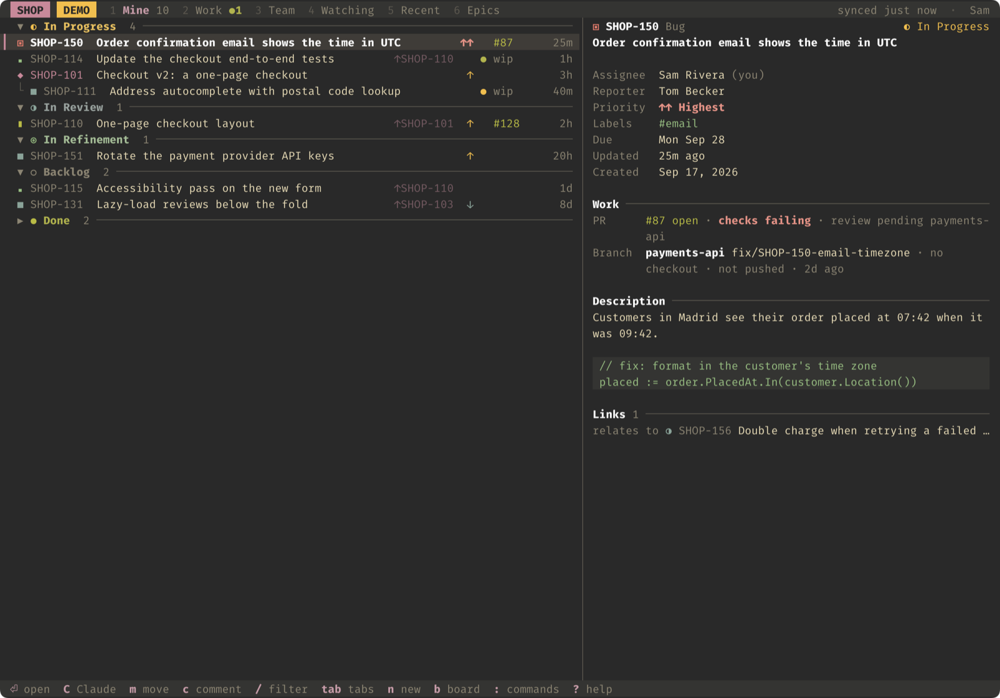
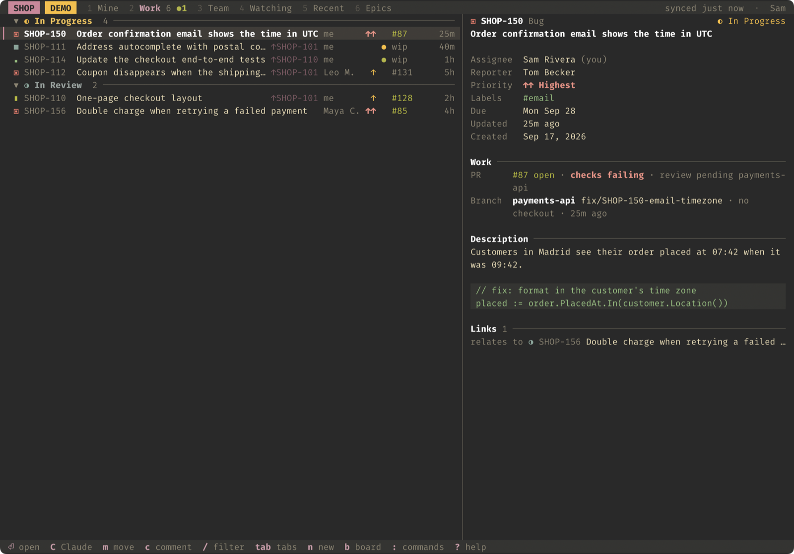
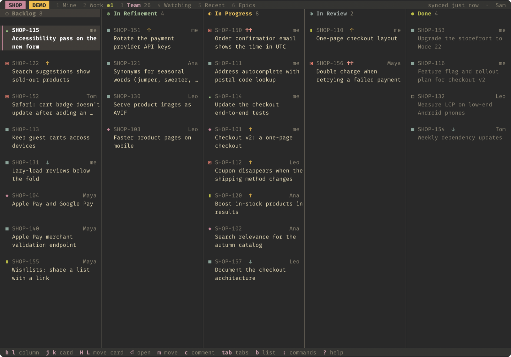
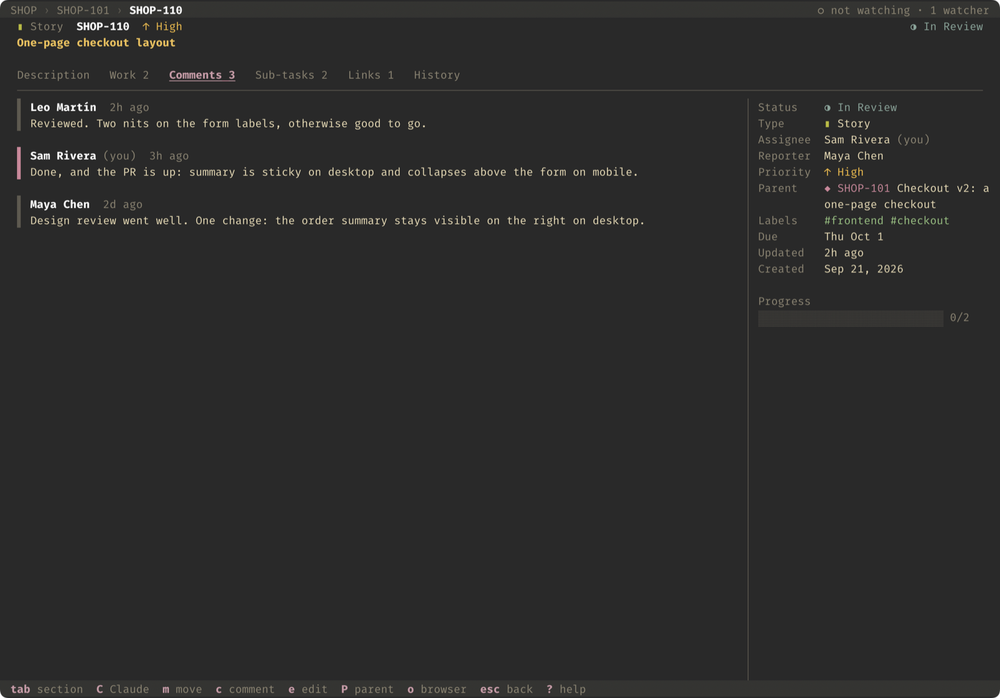
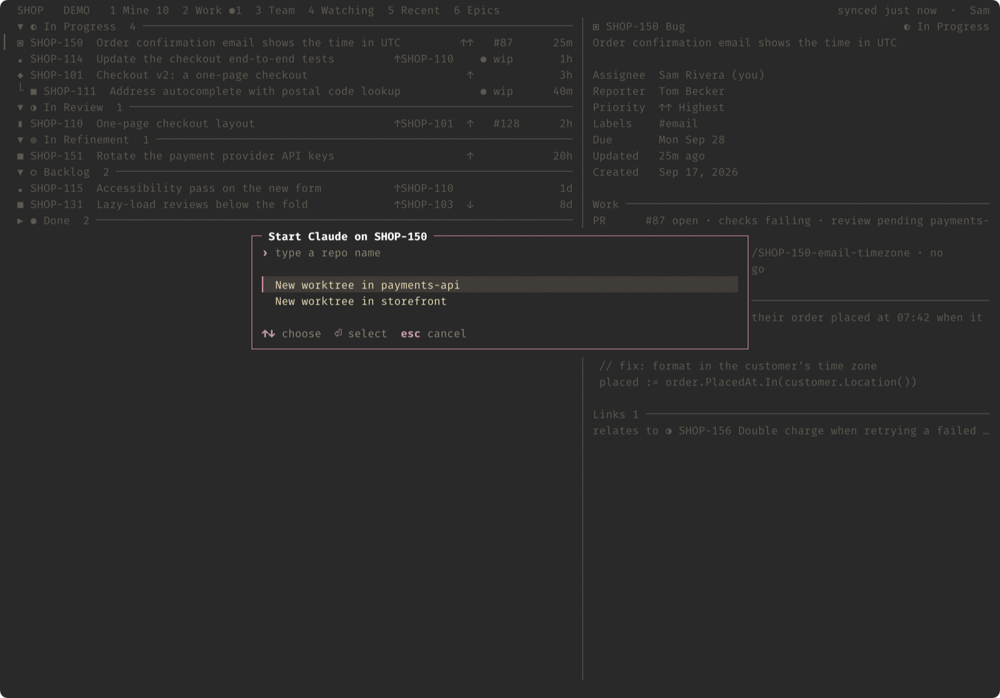

<h1 align="center">jira</h1>

<p align="center"><strong>Jira Cloud in your terminal — for you, your scripts and your AI agents.</strong><br>
A fast UI that links every ticket to its branches, pull requests and Claude Code sessions, and a CLI built for automation: a stable output contract on every command, and one call that gives an agent everything about a ticket.</p>

<p align="center">
  <a href="https://github.com/ngavilan-dogfy/jira-cli/releases/latest"></a>
  <a href="https://github.com/ngavilan-dogfy/jira-cli/actions/workflows/ci.yml"></a>
  
  <a href="LICENSE"></a>
</p>

<p align="center">
  
</p>

| For you | For scripts | For agents |
|---|---|---|
| `jira ui`: your tickets, the board, and everything in flight on each one — branches, pull requests with their checks, and the Claude Code sessions working on them. | One output contract everywhere: tables in a terminal, TSV in a pipe, JSON with `--json`, errors on stderr, meaningful exit codes. Markdown in, Jira's format out. | `jira context` puts a whole ticket — fields, comments, history, links, transitions — into one prompt-ready document, and a Claude Code skill knows the workflow. |

## Install

```bash
curl -fsSL https://raw.githubusercontent.com/ngavilan-dogfy/jira-cli/main/install.sh | sh
```

The installer picks the build for your OS and CPU, verifies it against the release's `checksums.txt`, and installs it to `~/.local/bin` without sudo. It then offers — never assumes — to add that folder to your `PATH`, to install the `/jira` skill if you use Claude Code, and to run `jira setup`. Running it again updates in place.

No Jira at hand? `jira ui --demo` opens a made-up team's project, with branches, pull requests and agents, so you can look around first. Nothing leaves your machine.

<details>
<summary><strong>Other ways to install, and uninstalling</strong></summary>

- **A specific version or folder**: `curl -fsSL …/install.sh | JIRA_VERSION=v1.1.0 JIRA_INSTALL_DIR=~/bin sh`. `JIRA_NO_SETUP=1`, `JIRA_NO_SKILL=1` and `JIRA_NO_MODIFY_PATH=1` keep it from asking.
- **With Go** (1.25+): `go install github.com/ngavilan-dogfy/jira-cli/cmd/jira@latest`
- **By hand**: download `jira-<os>-<arch>` from the [latest release](https://github.com/ngavilan-dogfy/jira-cli/releases/latest), check it against `checksums.txt`, make it executable and put it on your `PATH`. On Windows: `jira-windows-amd64.exe`.
- **From source**: `make install` builds and copies it to `~/.local/bin`.
- **Uninstall**: `rm ~/.local/bin/jira`; `rm -rf ~/.config/jira-cli` also removes your profiles and tokens; `jira skill remove` removes the Claude Code skill.

</details>

## Set up

```bash
jira setup
```

<p align="center"></p>

1. **Your Jira site** — paste any link from Jira, or just the site name. A link to a ticket also notes its project.
2. **Sign in** — with an **API token**, which works with Google and SSO accounts. Your email comes filled in from git, choosing the work identity when you keep several. Setup opens Atlassian's token page and says what to click; click **Copy** and the token is taken from your clipboard. If Jira refuses it, setup says why: the wrong email, a password instead of a token, an expired token. Companies that turned API tokens off can use the **browser login (OAuth)**, and setup walks through the one-time app registration.
3. **Default project** — where `jira ls` and `jira ui` start, and what short keys expand to (`306` → `OPS-306`).
4. **Extras** — where your repositories live, so branches and pull requests appear on their tickets; signing the GitHub CLI in if it isn't; and the Claude Code skill.

Nothing is saved until the end. Settings are written to `~/.config/jira-cli/`, readable only by you, and the token is cleared from the clipboard once saved. Run `jira setup` again to check everything, switch project or start over; `jira doctor` checks it all without changing anything.

In CI and containers there is nothing to set up — see [Configuration](#configuration).

## The terminal UI

`jira ui` opens on your last tab; `jira ui 306` jumps straight into a ticket.

| | |
|---|---|
| **Lists** — tabs for *Mine*, *Work*, *Team*, *Watching*, *Recent* and *Epics*, plus a *Search* (text or JQL). Issues are grouped by status, sub-tasks nested under their parent, finished work folded. Wide terminals preview the selected ticket, with code, tables, checklists and clickable links. |  |
| **Work** — every ticket with something in flight: local branches and worktrees (matched by the key in their name), pull requests with their checks and review state, and the Claude Code sessions on them, showing whether each is **working**, **waiting for you** or **needs approval**. |  |
| **Board** — `b` turns any tab into a Kanban board; `H` / `L` move a card to the neighbouring status. |  |
| **Detail** — description, work, comments, sub-tasks, links and history, with the fields on the side. `P` goes to the parent; `⏎` opens a sub-task or link. |  |
| **Start an agent** — `C` creates a worktree with a `<type>/<KEY>-<slug>` branch off the default branch (or continues the ticket's branch) and opens `claude` in a new iTerm2 tab with the ticket as its first message, without taking your focus. It can also assign the ticket to you and move it to *In Progress*. |  |

On any screen: `m` move, `c` comment (`Ctrl+E` opens `$EDITOR`), `e` edit fields, `E` edit the description in `$EDITOR`, `i` / `A` assign, `n` / `N` new issue or sub-task, `w` watch, `B` git branch, `y` / `Y` copy key or link, `o` open in the browser. `:` is the command palette — type a key or a number to jump to it — and `?` lists every key.

The UI paints with your terminal's own colors, remembers your tab, layout and folded groups, and caches each tab so it appears instantly and refreshes in the background.

## For agents

- **`jira context KEY`** is built for agents: fields, description, every comment in order, links, sub-tasks, attachments, history, available transitions, epic children, watchers and development info — one call, as markdown ready for a prompt, or `--json`. `--fast` skips the enrichment calls.
- **Keys are forgiving.** `100` means `PROJ-100` in your default project, and a pasted Jira link works wherever a key does: `jira context "https://acme.atlassian.net/browse/OPS-7"`.
- **`jira export --jql '…' --format md`** turns a whole epic or backlog into one document; `--comments` includes the discussion.
- **Writing is markdown.** Descriptions and comments are written in markdown and converted to Jira's document format, and read back the same way. `@[Full Name]` mentions a person (they are notified), and a bare URL becomes a link.
- **`jira batch <action>`** applies a move, an assignment, labels or a comment to every key on stdin; **`jira wait KEY --status Done`** blocks until a status is reached.

### Claude Code

```bash
jira skill install
```

Installs the `/jira` skill: load tickets with `context`, write in markdown, follow the workflow's transitions, and confirm anything it would otherwise infer. The skill ships inside the binary and is refreshed by `jira update`. [AGENTS.md](AGENTS.md) is the same guidance for any other agent.

## Scripting

- **stdout carries data only.** In a terminal, colored tables; when piped, tab-separated values with a header row; with `--json` (most commands), JSON and nothing else.
- **Exit codes**: `0` success, `1` failure (the message on stderr), `2` when `jira wait` times out.
- **Retries** are built in: 429 is retried on any request and 5xx on reads, honoring `Retry-After`. Don't add your own on top.
- **Search** uses Jira's paginated JQL endpoint, which returns no total; `--limit` caps how many issues are fetched.

JSON field names are treated as a public interface: renaming or removing one is a breaking change and ships as a new major version.

## Configuration

**Profiles.** `jira setup --profile work` creates another profile; `jira profile use work` switches to it; `jira profile ls` lists them. `jira config` shows and edits the active one.

| Variable | Effect |
|---|---|
| `JIRA_DOMAIN`, `JIRA_EMAIL`, `JIRA_TOKEN` | Sign in with an API token without a profile: the site name (`acme`), your Atlassian email and the token. |
| `JIRA_PROJECT` | Default project for short keys and `jira ls`. |
| `JIRA_REPOS` | Folder with your git checkouts, one level down, for the UI's *Work* tab. |
| `JIRA_NO_UPDATE_NOTIFIER=1` | Don't mention new releases after commands. |

Non-interactive setup takes the token on stdin: `echo "$JIRA_TOKEN" | jira setup --site acme --email you@acme.com --token-stdin --project OPS`.

| Path | Contents |
|---|---|
| `~/.config/jira-cli/profiles/*.yaml` | Profiles: site, sign-in method and credentials (mode 0600) |
| `~/.config/jira-cli/active` | The active profile's name |
| `~/.config/jira-cli/client_id`, `client_secret` | The OAuth app used by browser login, shared by profiles (mode 0600) |
| `~/.config/jira-cli/tui-<profile>.json` | UI state: tab, layout, folded groups |
| `~/.config/jira-cli/templates/` | Your issue templates |
| `<OS cache dir>/jira-cli/` | Cached tabs, agent prompts and the daily update check |

## Security and privacy

- Credentials never leave your machine except to authenticate against Atlassian. The CLI talks to your Jira site, Atlassian's sign-in and API hosts, a local callback during browser login, and GitHub for updates; there is no telemetry. The UI runs your local `git`, `gh` and `claude` to show and start work.
- OAuth sessions refresh under a file lock, so several processes — you and a few agents — can share one without invalidating each other.
- The clipboard is read only while setup waits for a token, only a value shaped like an Atlassian token is taken, and it is cleared from the clipboard once saved.
- Updates are verified against the release's SHA-256 checksums, and the new binary must run before it replaces the old one.

To report a vulnerability, see [SECURITY.md](SECURITY.md).

## Troubleshooting

`jira doctor` checks the install, your `PATH`, the site, your session, the project and the optional tools, and prints a fix for each problem.

| You see | Do this |
|---|---|
| `command not found: jira` | Open a new terminal. If it persists, add `export PATH="$HOME/.local/bin:$PATH"` to `~/.zshrc` or `~/.bashrc`. |
| *Jira didn't accept that email + token* | Use the email you sign in to Atlassian with and an **API token** (not your password); create a new one if it expired. |
| *Jira refused access*, or API tokens are disabled | `jira setup` → *Browser login (OAuth)*. |
| Pull requests don't show on tickets | `gh auth login`, or run `jira setup` and accept the GitHub sign-in in the extras. |
| `jira` runs a different tool | Another `jira` comes first in your `PATH`; `jira doctor` says which. |

## Updating

```bash
jira update
```

Shows what's new, downloads the release for your machine, verifies its checksum and that it runs, and only then replaces the current binary; your settings are untouched. When a newer release exists, commands run in a terminal mention it after their output — checked in the background, at most once a day.

## Contributing

`make check` runs vet, the tests and a build. Releases are cut automatically from [Conventional Commits](https://www.conventionalcommits.org) on `main`. Start with [CONTRIBUTING.md](CONTRIBUTING.md); [ARCHITECTURE.md](ARCHITECTURE.md) maps the code and the decisions behind it.

## License

[MIT](LICENSE)
